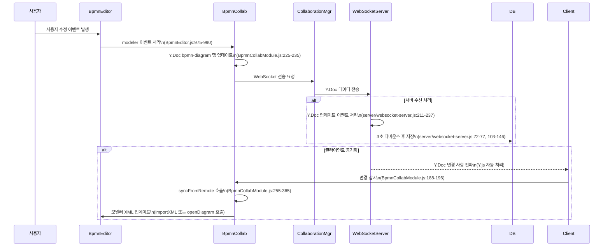

# BPMN 다중 클라이언트 동기화 과정 분석

## 📋 문서 개요

이 문서는 BPMN 협업 에디터에서 사용자가 문서를 수정했을 때 서버와 각 클라이언트 간의 동기화 과정을 상세히 분석합니다. 특히 "수정했다가 본래대로 돌아가는 문제"를 해결하기 위한 기술적 분석을 포함합니다.

**작성일**: 2024년 12월 (최신 코드 기준)  
**대상 시스템**: BPMN Collaborative Editor v0.1.0  
**기술 스택**: Y.js CRDT, WebSocket, Node.js, PostgreSQL (Supabase)

---

## 🔄 호출 관계 도표

```
[사용자 수정] 
    ↓
[BpmnEditor.modeler 이벤트] (src/editor/BpmnEditor.js:975-990)
    ↓
[BpmnCollaborationModule.syncToRemote] (src/collaboration/BpmnCollaborationModule.js:214-242)
    ↓
[Y.Doc bpmn-diagram 맵 업데이트] (src/collaboration/BpmnCollaborationModule.js:225-235)
    ↓
[CollaborationManager WebSocket 전송] (src/collaboration/CollaborationManager.js:자동)
    ↓
[WebSocket Server Y.Doc 수신] (server/websocket-server.js:setupWSConnection)
    ↓
┌─────────────────────────────────────────┬─────────────────────────────────────────┐
│ [서버 Y.Doc 업데이트 이벤트]             │ [다른 클라이언트들에게 Y.Doc 전파]       │
│ (server/websocket-server.js:211-237)    │ (Y.js 자동 처리)                        │
│         ↓                               │         ↓                               │
│ [3초 디바운스 저장 스케줄링]             │ [클라이언트 Y.Doc 변경 감지]             │
│ (server/websocket-server.js:72-77)      │ (src/collaboration/BpmnCollaborationModule.js:188-196) │
│         ↓                               │         ↓                               │
│ [데이터베이스 저장]                      │ [syncFromRemote 호출]                   │
│ (server/websocket-server.js:103-146)    │ (src/collaboration/BpmnCollaborationModule.js:255-365) │
│                                         │         ↓                               │
│                                         │ [모델러 XML 업데이트]                    │
│                                         │ (Primary: modeler.importXML 직접 호출)  │
│                                         │ (Fallback: BpmnEditor.openDiagram)     │
└─────────────────────────────────────────┴─────────────────────────────────────────┘
```

### Mermaid 호출 관계 도표



---

## 📝 상세 동기화 과정 분석

### 1단계: 사용자 수정 감지 및 로컬 처리

#### 📍 **BpmnEditor.js - 모델러 이벤트 처리**
- **위치**: `src/editor/BpmnEditor.js:975-990`
- **함수**: `setupEventListeners()` 내부의 change 이벤트 리스너
- **코드**:
```javascript
this.modeler.on(['commandStack.changed'], debounce((event) => {
  if (this.collaborationModule && this.collaborationModule.isConnectedToServer()) {
    this.collaborationModule.syncToRemote();
    // console.log('📤 Synced changes to collaboration server'); // Disabled: too verbose
  } else {
    // console.log('🔍 Collaboration sync skipped:', {
    //   hasModule: !!this.collaborationModule,
    //   isConnected: this.collaborationModule && this.collaborationModule.isConnectedToServer()
    // });
  }
}, 500));
```

**🔍 분석**:
- 사용자가 BPMN 요소를 수정하면 `commandStack.changed` 이벤트 발생
- 500ms debounce로 과도한 호출 방지
- 협업 모듈이 연결된 경우에만 `syncToRemote()` 호출

### 2단계: Y.Doc 업데이트 및 원격 동기화

#### 📍 **BpmnCollaborationModule.js - syncToRemote**
- **위치**: `src/collaboration/BpmnCollaborationModule.js:214-242`
- **함수**: `syncToRemote()`
- **핵심 코드**:
```javascript
async syncToRemote() {
  if (!this.isInitialized || !this.collaborationEnabled) return;
  
  try {
    const currentXml = await this.getCurrentBpmnXml();
    
    // Y.Doc 공유 맵에 XML 설정
    this.sharedDiagram.set('xml', currentXml);
    
    // 마지막 동기화 시간 업데이트
    this.syncState.lastLocalChange = Date.now();
    this.syncState.lastSyncedXml = currentXml;
    
    // console.log('📤 로컬 변경사항을 원격에 동기화했습니다.'); // Disabled: too verbose
  } catch (error) {
    console.error('원격 동기화 실패:', error);
  }
}
```

**🔍 분석**:
- 현재 BPMN XML을 모델러에서 추출
- Y.Doc의 `bpmn-diagram` 맵에 XML 저장
- Y.js가 자동으로 WebSocket을 통해 서버에 전송
- `lastSyncedXml` 상태 업데이트로 중복 동기화 방지

### 3단계: 서버 측 Y.Doc 처리 및 영속성

#### 📍 **websocket-server.js - Y.Doc 업데이트 이벤트**
- **위치**: `server/websocket-server.js:211-237`
- **함수**: `setupDocumentPersistence()` 내의 Y.Doc update 이벤트
- **핵심 코드**:
```javascript
ydoc.on('update', (update, origin) => {
  const metadata = documentMetadata.get(roomId)
  if (!metadata) return

  const now = Date.now()
  
  // 변경사항이 실제로 있는지 확인
  const bpmnMap = ydoc.getMap('bpmn-diagram')
  const currentXml = bpmnMap.get('xml')
  
  // 이전 XML과 비교하여 실제 변경이 있었는지 확인
  if (metadata.lastSavedXml && currentXml === metadata.lastSavedXml) {
    return // 변경사항 없음
  }
  
  metadata.lastChanged = now
  metadata.lastSavedXml = currentXml

  // 3초 디바운스 저장
  debouncedSave()
  
  // 1분 강제 저장 타이머 재설정
  scheduleForceSave()
})
```

**🔍 분석**:
- Y.Doc 업데이트 시 자동으로 이벤트 발생
- XML 내용 변경 여부를 실제로 확인
- 3초 디바운스와 1분 강제 저장의 이중 전략
- **중요**: 이 시점에서 다른 클라이언트들에게도 Y.Doc 변경사항이 자동 전파됨

#### 📍 **websocket-server.js - 데이터베이스 저장**
- **위치**: `server/websocket-server.js:103-146`
- **함수**: `saveDocumentToDatabaseWithLog()`
- **핵심 코드**:
```javascript
async function saveDocumentToDatabaseWithLog(roomId, ydoc, reason) {
  const metadata = documentMetadata.get(roomId)
  if (!metadata || !metadata.diagramId) return false

  if (metadata.saveInProgress) {
    // console.log(`⏳ 저장 진행 중: ${metadata.name}`) // Disabled: too verbose
    return false
  }

  metadata.saveInProgress = true

  try {
    // Y.Doc에서 BPMN XML 추출
    const bpmnMap = ydoc.getMap('bpmn-diagram')
    const bpmnXml = bpmnMap.get('xml')

    if (!bpmnXml) return false

    const success = await saveDocumentToDatabase(
      metadata.diagramId,
      bpmnXml,
      reason,
      metadata.lastModifiedBy
    )

    if (success) {
      metadata.lastSaved = Date.now()
    }

    return success
  } catch (error) {
    console.warn(`⚠️ 저장 오류: ${metadata.name}`, error.message)
    return false
  } finally {
    metadata.saveInProgress = false
  }
}
```

### 4단계: 다른 클라이언트에서의 변경 감지 및 동기화

#### 📍 **BpmnCollaborationModule.js - 원격 변경 감지**
- **위치**: `src/collaboration/BpmnCollaborationModule.js:188-196`
- **함수**: `setupEventListeners()` 내의 Y.Doc observe
- **핵심 코드**:
```javascript
this.sharedDiagram.observe((event) => {
  // console.log('📨 Remote change detected, syncing from remote'); // Disabled: too verbose
  this.syncFromRemote();
});
```

#### 📍 **BpmnCollaborationModule.js - syncFromRemote**
- **위치**: `src/collaboration/BpmnCollaborationModule.js:255-365`
- **함수**: `syncFromRemote()`
- **핵심 코드**:
```javascript
async syncFromRemote() {
  if (!this.isInitialized || this.syncState.isSyncing) return;

  try {
    this.syncState.isSyncing = true;
    
    const remoteXml = this.sharedDiagram.get('xml');
    
    if (remoteXml) {
      const currentXml = await this.getCurrentBpmnXml();
      
      // 변경사항이 있는지 확인 (현재 로컬 XML과만 비교)
      const isDifferent = remoteXml !== currentXml;
      
      if (!isDifferent) {
        // console.log('✅ XML content is same as current, no sync needed'); // Disabled: too verbose
        return;
      }
      
      // PRIMARY: Y.Doc의 실시간 데이터를 직접 사용
      try {
        // 모델러 준비 상태 확인
        if (!this.modeler || !this.modeler.get) {
          throw new Error('Modeler not ready for import');
        }
        
        // DOM 요소 확인
        const canvas = this.modeler.get('canvas');
        if (!canvas || !canvas.getContainer()) {
          throw new Error('Canvas container not ready');
        }
        
        // Y.Doc의 실시간 데이터를 직접 사용 (서버 API 호출 없이)
        await this.modeler.importXML(remoteXml);
        this.syncState.lastSyncedXml = remoteXml;
        
      } catch (directImportError) {
        console.log('⚠️ Direct import failed, trying BpmnEditor as fallback:', directImportError.message);
        
        // FALLBACK: BpmnEditor를 통한 동기화 시도 (서버 API 사용)
        if (window.appManager && window.appManager.bpmnEditor) {
          const diagramData = {
            id: this.getCurrentDiagramId(),
            content: remoteXml,
            bpmn_xml: remoteXml
          };
          
          await window.appManager.bpmnEditor.openDiagram(diagramData);
          this.syncState.lastSyncedXml = remoteXml;
        }
      }
    }
  } catch (error) {
    console.log('⚠️ Import process failed:', error.message);
  } finally {
    this.syncState.isSyncing = false;
  }
}
```

**🔍 분석**:
- Y.Doc 변경 감지 시 즉시 호출
- **Primary 방식**: Y.Doc에서 받은 XML을 직접 모델러에 적용
- **Fallback 방식**: DOM 에러 시 BpmnEditor.openDiagram 사용 (서버 API 호출)
- 현재 로컬 XML과 비교하여 실제 변경사항이 있을 때만 적용

---

## ⚠️ 문제 발생 가능 지점들

### 1. **타이밍 문제 (시간차 동기화)**

**문제 시나리오**:
```
클라이언트 A: 요소 수정 → Y.Doc 업데이트 (즉시)
서버: Y.Doc 받음 → 3초 후 DB 저장
클라이언트 B: Y.Doc 변경 감지 → syncFromRemote 호출

[만약 Fallback 방식 사용 시]
클라이언트 B: openDiagram → 서버 API 호출
서버: 아직 DB 저장 안됨 → 이전 XML 반환 ❌
클라이언트 B: 이전 XML로 되돌림 → Y.Doc에 전파
클라이언트 A: 자신의 변경사항이 사라짐 ❌
```

**현재 해결책**:
- Primary 방식으로 Y.Doc 실시간 데이터 직접 사용
- Fallback은 DOM 에러 등 예외 상황에만 사용

### 2. **순환 참조 문제**

**문제 시나리오**:
```
클라이언트 A: 수정 → Y.Doc 업데이트 → 다른 클라이언트들에게 전파
클라이언트 A: 자신이 보낸 변경사항을 다시 받음 → syncFromRemote 호출 가능성
```

**현재 해결책**:
- `lastSyncedXml` 상태로 중복 동기화 방지
- 현재 로컬 XML과 원격 XML 비교

### 3. **DOM 준비 상태 문제**

**문제**: modeler DOM이 준비되지 않은 상태에서 `importXML` 호출
**오류**: `Cannot read properties of undefined (reading 'root-6')`

**현재 해결책**:
```javascript
// 모델러 준비 상태 확인
if (!this.modeler || !this.modeler.get) {
  throw new Error('Modeler not ready for import');
}

// DOM 요소 확인
const canvas = this.modeler.get('canvas');
if (!canvas || !canvas.getContainer()) {
  throw new Error('Canvas container not ready');
}
```

### 4. **XML 비교 로직 문제**

**이전 문제**: 너무 엄격한 비교 조건
```javascript
// 문제가 있던 코드
const isReallyDifferent = remoteXml !== currentXml && remoteXml !== this.syncState.lastSyncedXml;
```

**현재 해결책**: 단순화된 비교
```javascript
// 현재 코드
const isDifferent = remoteXml !== currentXml;
```

---

## 🏗️ 현재 아키텍처의 특징

### ✅ **장점**

1. **실시간 동기화**: Y.js CRDT 기반으로 실시간 변경사항 전파
2. **충돌 해결**: CRDT 특성상 동시 편집 시 자동 병합
3. **이중 안전장치**: Primary/Fallback 방식으로 안정성 확보
4. **효율적 저장**: 디바운스 및 강제 저장으로 성능 최적화
5. **연결 복원력**: WebSocket 연결 끊어져도 재연결 시 동기화

### ⚠️ **제한사항**

1. **서버 의존성**: 완전한 P2P가 아닌 서버 경유 방식
2. **XML 기반 동기화**: 바이너리 차이보다 상대적으로 무거움
3. **복잡한 상태 관리**: 여러 동기화 상태 추적 필요
4. **디버깅 복잡성**: 비동기 다중 클라이언트 환경

### 🔧 **개선 가능 영역**

1. **더 정밀한 변경 감지**: XML 문자열 대신 구조적 비교
2. **사용자 편집 중 보호**: 편집 중인 요소는 동기화 지연
3. **충돌 시각화**: 동시 편집 충돌 발생 시 사용자에게 알림
4. **성능 모니터링**: 동기화 지연 시간 및 실패율 추적

---

## 📊 데이터 흐름 상태 추적

### 클라이언트 A (수정자)
```
1. 사용자 수정
2. modeler 이벤트 발생 (BpmnEditor.js:975)
3. syncToRemote 호출 (BpmnCollaborationModule.js:214)
4. Y.Doc 맵 업데이트 (bpmn-diagram.set('xml', newXml))
5. lastSyncedXml = newXml 저장
```

### 서버
```
1. Y.Doc 업데이트 수신 (websocket-server.js:211)
2. XML 변경 여부 확인
3. debouncedSave 스케줄링 (3초 후)
4. scheduleForceSave 타이머 리셋 (1분)
5. 다른 클라이언트들에게 Y.Doc 전파 (자동)
```

### 클라이언트 B (수신자)
```
1. Y.Doc 변경 감지 (BpmnCollaborationModule.js:188)
2. syncFromRemote 호출 (BpmnCollaborationModule.js:255)
3. 현재 XML vs 원격 XML 비교
4. [Primary] modeler.importXML(remoteXml) 직접 호출
5. [Fallback] BpmnEditor.openDiagram 호출 (실패 시)
6. lastSyncedXml = remoteXml 저장
```

---

## 🎯 **결론 및 권장사항**

현재 시스템은 **Primary 방식(Y.Doc 직접 동기화)**을 통해 대부분의 타이밍 문제를 해결했습니다. 하지만 여전히 다음과 같은 모니터링이 필요합니다:

1. **Fallback 사용 빈도**: DOM 에러로 인한 Fallback 사용을 최소화
2. **동기화 지연**: 변경사항 전파 시간 모니터링  
3. **중복 동기화**: 같은 변경사항의 중복 처리 방지
4. **메모리 사용량**: Y.Doc 히스토리 관리

**변경사항이 되돌아가는 문제**는 현재 Primary 방식 도입으로 대부분 해결되었으나, Fallback 로직이 여전히 작동하는 경우 문제가 재발할 수 있습니다.